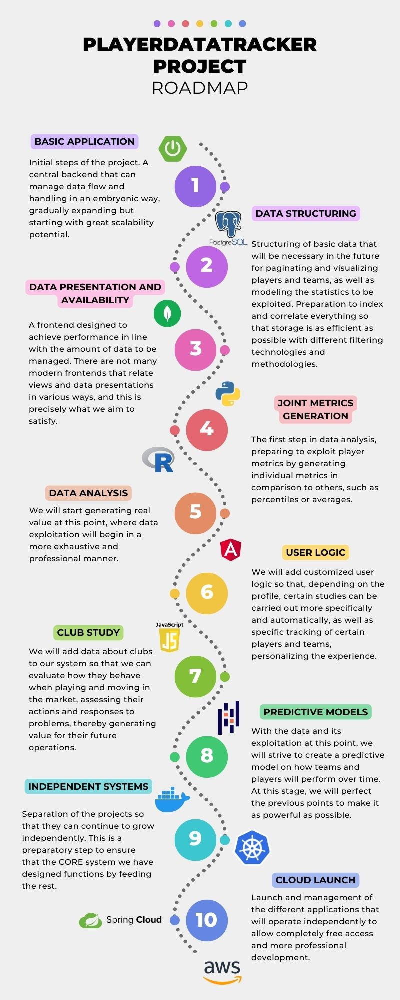

# playerdatatracking

Bienvenido a PlayerDataTracking! Una aplicación que junta el análisis de datos y el seguimiento de jugadores de fútbol para llevar un seguimiento del deporte más exhaustivo!

En este repositorio encontrarás todos los ficheros relativos al proyecto bruto para que puedas explorar libremente cómo trabajamos.

Próximamente añadiremos una versión ejecutable para que puedas usar la aplicación libremente a tu gusto de forma totalmente libre!

Además también añadiremos una buena cantidad de documentación para que comprendas mejor la arquitectura del proyecto!

Si decides explorar el código del proyecto ten en cuenta las siguientes consideraciones:

- En la rama main encontrarás las versiones del proyecto cerradas, es decir, las operaciones completas que funcionan como nos gustaría (sin tener en cuenta posibles errores de funcionamiento claro).
- En la rama develop encontrarás la última versión del desarrollo. Si tu intención es revisar las actualizaciones que se van haciendo, ese es tu lugar!
- Las ramas develop-backend, develop-frontend y develop-api-data son ramas auxiliares para tocar las partes del proyecto de una forma menos delicada y que pòdrían afectar al resto del proyecto.

Si quieres saber en qué punto del proyecto estamos, te dejo aquí un roadmap para que lo revises tranquilamente. En este momento nos encontramos en la fase 1, de tal forma que estamos trabajando en la estructura básica del proyecto:

Si quieres contactar conmigo te adjunto mi contacto:

- correo: rodrigomarquesjn@hotmail.com
- [Linkedin](https://www.linkedin.com/in/rodrigo-marqués-buil-607a431b3/)